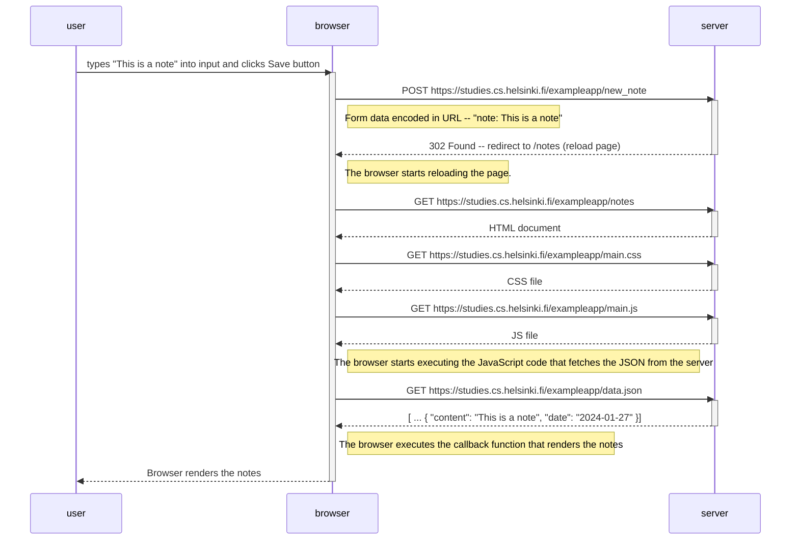

The following is a sequence diagram depicting the situation where the user creates a new note on [this page](https://studies.cs.helsinki.fi/exampleapp/notes) by writing something into the text field and clicking the *Save* button.

