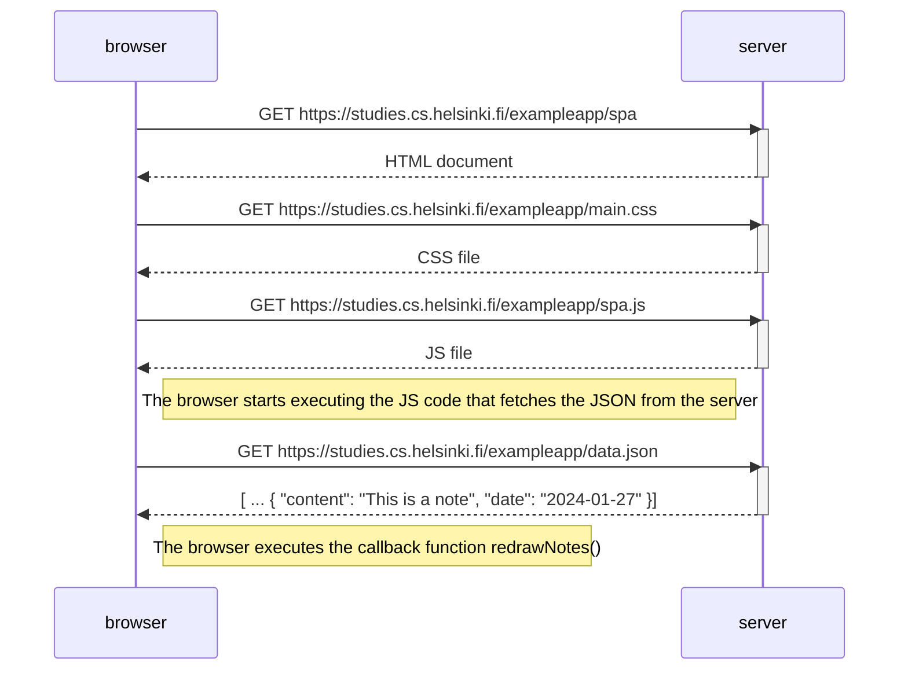

The following is a sequence diagram depicting the situation where the user visits [this page](https://studies.cs.helsinki.fi/exampleapp/spa).

```mermaid
sequenceDiagram
    participant browser
    participant server

    browser->>server: GET https://studies.cs.helsinki.fi/exampleapp/spa
    activate server
    server-->>browser: HTML document
    deactivate server

    browser->>server: GET https://studies.cs.helsinki.fi/exampleapp/main.css
    activate server
    server-->>browser: CSS file
    deactivate server

    browser->>server: GET https://studies.cs.helsinki.fi/exampleapp/spa.js
    activate server
    server-->>browser: JS file
    deactivate server

    Note right of browser: The browser starts executing the JS code that fetches the JSON from the server

    browser->>server: GET https://studies.cs.helsinki.fi/exampleapp/data.json
    activate server
    server-->>browser: [ ... { "content": "This is a note", "date": "2024-01-27" }]
    deactivate server

    Note right of browser: The browser executes the callback function redrawNotes()
```